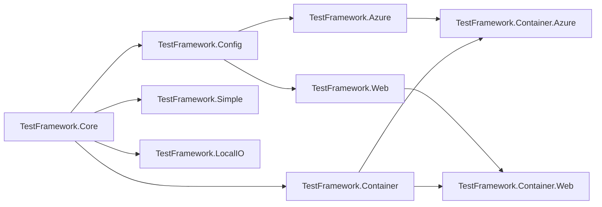

# Compatibility and versions

## Target frameworks

Every package targets `net8.0` and `net10.0`. The two surfaces are identical - there is no
framework-conditional API anywhere in the packages - so the API reference on this site documents
`net8.0`, the lower bound a consumer can be on, and it applies equally to `net10.0`.

## Documented versions

[!INCLUDE [versions](../includes/versions.md)]

## Dependency and publish order

The packages form a chain. It matters twice: a dependency must be installed before its dependents can
resolve, and a dependency must be *published* before a dependent can ship a version that requires it.

Read that as installed dependencies, not as a build order. `TestFramework.Azure` and
`TestFramework.Web` pull in `TestFramework.Config` as well as `TestFramework.Core`, so configuration
arrives with them whether you asked for it or not. `TestFramework.Container` depends on Core alone -
it is shared Docker plumbing and knows nothing about Azure or the web - and the two
`Container.*` packages are where a transport and that plumbing meet.

For releasing, the order that matters is a topological walk of the same graph: Core, then Config and
Simple, then Azure, LocalIO and Web, then Container, then Container.Azure and Container.Web. A
dependency has to exist on nuget.org before a dependent can ship a version that requires it.

In practice `TestFramework.Core` is the only package you must install deliberately. Everything else is
additive:

| Add this | To test |
|---|---|
| `TestFramework.Config` | configuration and dependency injection setup |
| `TestFramework.Simple` | small flows, with lightweight triggers |
| `TestFramework.Azure` | Function Apps, Logic Apps, Service Bus, Storage, Cosmos, SQL |
| `TestFramework.LocalIO` | shell commands and file artifacts |
| `TestFramework.Web` | REST APIs, SQL Server behind them, stubbed dependencies |
| `TestFramework.Container` | the container source model the Docker lanes share |
| `TestFramework.Container.Azure` | the above Azure components against emulators in Docker |
| `TestFramework.Container.Web` | the above web components against containers |

## Symbols and stepping into the code

Every package is built with SourceLink and produces a symbol package (`.snupkg`), so a debugger can
step from your test into the framework's own source. The same data puts a **View source** link on every
type in the [API reference](../../api/index.md), and is why each link lands in that package's own
repository rather than in a single monolith.

> [!NOTE]
> Symbol packages are a recent addition. Until a release carries them, `TestFramework.LocalIO` is the
> only package with a published `.snupkg`; the rest can still be read on GitHub through the reference's
> view-source links.
